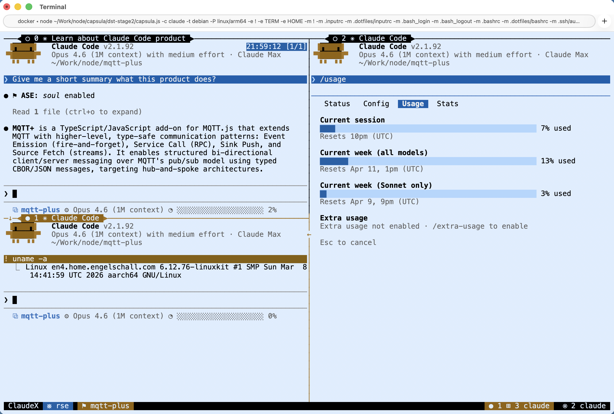
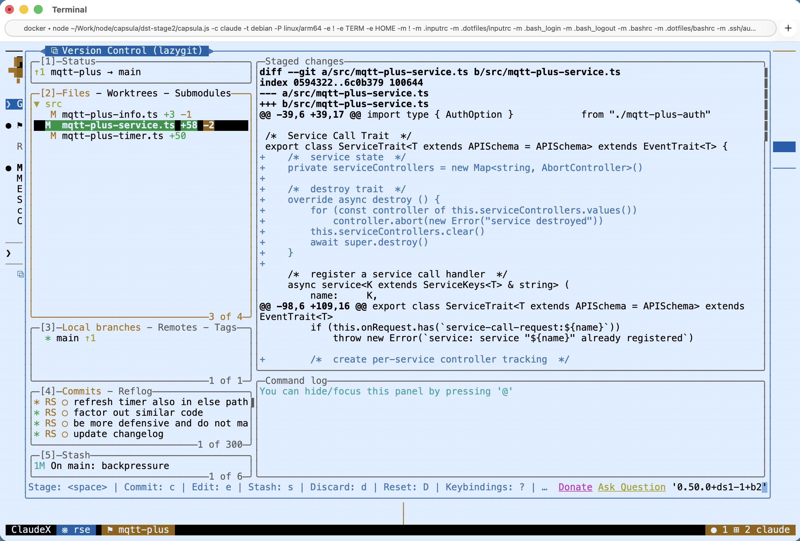
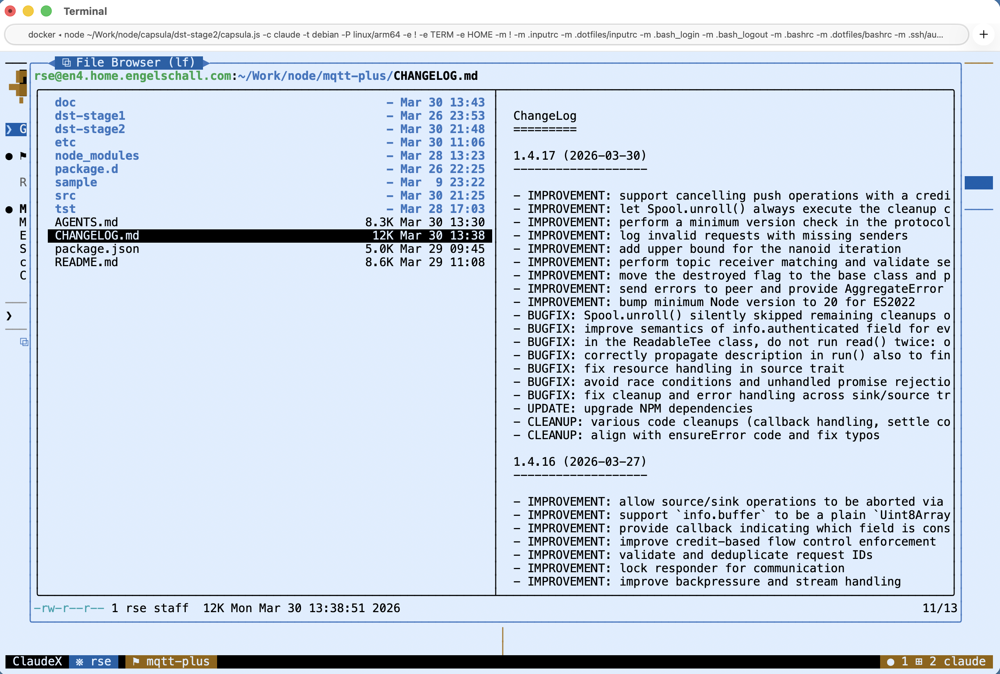
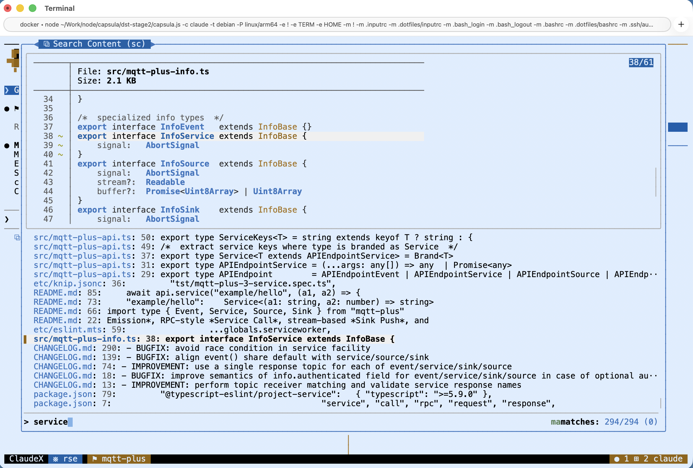
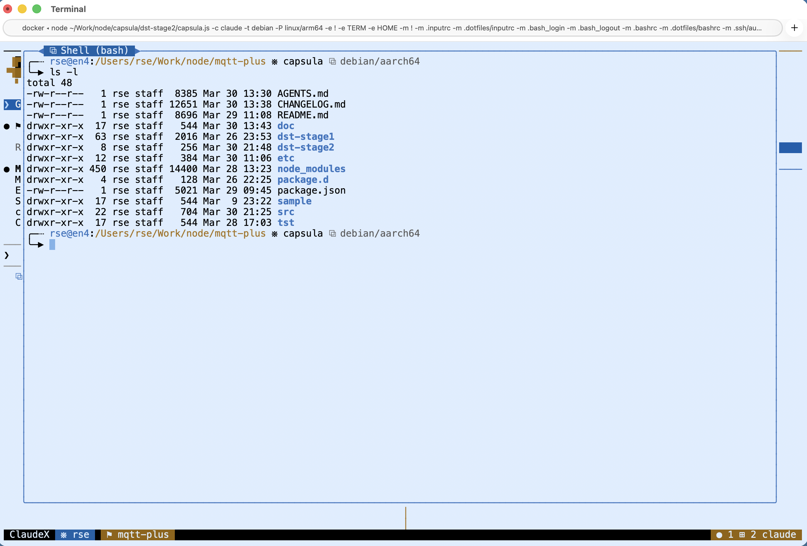

claudeX -- Claude Code eXtended
===============================

This is *Dr. Ralf S. Engelschall* (RSE)'s opinionated [Claude Code](https://code.claude.com)
environment for macOS and Linux. It mainly provides a thin `claudex` (claude eXtended)
wrapper command which provides the following distinct features on top of the regular
Claude Code command:

- **Encapsulated Runtime**: It uses the companion tool
  [capsula](https://github.com/rse/capsula), also from RSE, for
  executing `claude` inside a cleverly established Docker container,
  which mimicks the host environment (filesystem layout, user/group
  name/id, etc) as close as possible.

  *Rationale*: Prevents any programs `claude` spawns from
  damaging more than the current working directory.

- **Adjusted Theme**: It uses the companion tool [ansi-recolor](https://github.com/rse/ansi-recolor),
  also from RSE, to on-the-fly re-color Claude Code's terminal UI
  (configured to run in regular light theme) into the RSE brown/blue
  color theme, without having to patch Claude Code (with tools like
  TweakCC, which regularly have to be updated to not fail on this task).

  *Rationale*: RSE is obsessed from "distraction free coding", which,
  for him, implies that everthing has to use his unobtrusive brown/blue
  color theme.

- **Terminal Multiplexing**: It uses the companion tool [tmux](https://github.com/tmux/tmux)
  to run Claude Code and its companion tools in an opinionated virtual
  terminal environment, with multiple screens and multiple panes on each
  screen.

  *Rationale*: Allow one to easily run multiple Claude Code sessions in
  parallel with full terminal interaction.

- **Companion Tools**: It allows you to execute (visually in a modal window on top
  of Claude Code with the help of tmux popups) the companion tools
  [LazyGit](https://github.com/jesseduffield/lazygit) (for Git version
  control), [LF](https://github.com/gokcehan/lf) (for Filesystem
  Browsing), and [SC](https://github.com/rse/bash-sc) (also from RSE,
  for File Searching), and [Bash](https://www.gnu.org/software/bash/)
  (for Shell).

  *Rationale*: The most important companion tool is LazyGit, allowing
  the easily partial backout of changes Claude Code made to source code.

Impressions
-----------

The following is a main view of the macOS Terminal with a **claudeX**
session running. Three Claude Code instances are running in separate
panes of the screen.



This is with LazyGit opened in a modal window:



This is with LF opened in a modal window:



This is with SC opened in a modal window:



This is with Bash opened in a modal window:



Installation
------------

```sh
$ git clone https://github.com/rse/claudex /path/to/somewhere
$ ln -s /path/to/somewhere/claudex ~/bin/claudex
$ npm install
$ claudex install
```

Usage
-----

```sh
$ claudex session
```

See Also
--------

- [Agentic Software Engineering (ASE)](https://github.com/rse/ase)

License
-------

Copyright &copy; 2025-2026 Dr. Ralf S. Engelschall (http://engelschall.com/)

Permission is hereby granted, free of charge, to any person obtaining
a copy of this software and associated documentation files (the
"Software"), to deal in the Software without restriction, including
without limitation the rights to use, copy, modify, merge, publish,
distribute, sublicense, and/or sell copies of the Software, and to
permit persons to whom the Software is furnished to do so, subject to
the following conditions:

The above copyright notice and this permission notice shall be included
in all copies or substantial portions of the Software.

THE SOFTWARE IS PROVIDED "AS IS", WITHOUT WARRANTY OF ANY KIND,
EXPRESS OR IMPLIED, INCLUDING BUT NOT LIMITED TO THE WARRANTIES OF
MERCHANTABILITY, FITNESS FOR A PARTICULAR PURPOSE AND NONINFRINGEMENT.
IN NO EVENT SHALL THE AUTHORS OR COPYRIGHT HOLDERS BE LIABLE FOR ANY
CLAIM, DAMAGES OR OTHER LIABILITY, WHETHER IN AN ACTION OF CONTRACT,
TORT OR OTHERWISE, ARISING FROM, OUT OF OR IN CONNECTION WITH THE
SOFTWARE OR THE USE OR OTHER DEALINGS IN THE SOFTWARE.

